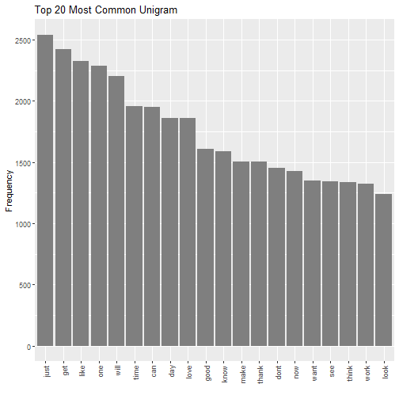
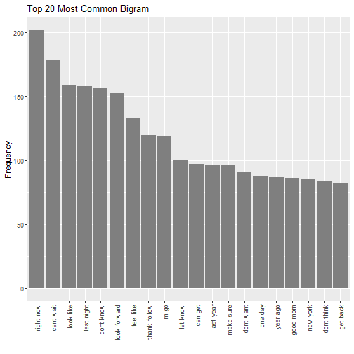

Load Data

```r
library(tm)
```

```
## Loading required package: NLP
```

```
## 
## Attaching package: 'NLP'
```

```
## The following objects are masked from 'package:quanteda':
## 
##     meta, meta<-
```

```
## 
## Attaching package: 'tm'
```

```
## The following objects are masked from 'package:quanteda':
## 
##     as.DocumentTermMatrix, stopwords
```

```r
library(SnowballC)
library(stringi)
library(ggplot2) 
```

```
## 
## Attaching package: 'ggplot2'
```

```
## The following object is masked from 'package:NLP':
## 
##     annotate
```

```r
library(wordcloud)
```

```
## Loading required package: RColorBrewer
```

```r
library(data.table)
```

```
## data.table 1.13.0 using 2 threads (see ?getDTthreads).  Latest news: r-datatable.com
```

```r
library(dplyr)
```

```
## 
## Attaching package: 'dplyr'
```

```
## The following objects are masked from 'package:data.table':
## 
##     between, first, last
```

```
## The following objects are masked from 'package:stats':
## 
##     filter, lag
```

```
## The following objects are masked from 'package:base':
## 
##     intersect, setdiff, setequal, union
```

```r
library(kableExtra)
```

```
## 
## Attaching package: 'kableExtra'
```

```
## The following object is masked from 'package:dplyr':
## 
##     group_rows
```

```r
library(RColorBrewer)
library(RWeka)

setwd("C:/Users/dongj/Desktop/R_data_Desk/Capstone/Capstone_Project")

# blogs
blogsFileName <- "data/en_US.blogs.txt"
con <- file(blogsFileName, open = "r")
blogs <- readLines(con, encoding = "UTF-8", skipNul = TRUE)
close(con)

# news
newsFileName <- "data/en_US.news.txt"
con <- file(newsFileName, open = "r")
news <- readLines(con, encoding = "UTF-8", skipNul = TRUE)
```

```
## Warning in readLines(con, encoding = "UTF-8", skipNul = TRUE): incomplete final line found on
## 'data/en_US.news.txt'
```

```r
close(con)

# twitter
twitterFileName <- "data/en_US.twitter.txt"
con <- file(twitterFileName, open = "r")
twitter <- readLines(con, encoding = "UTF-8", skipNul = TRUE)
close(con)

rm(con)
```

Analyze Data

```r
numLines <- sapply(list(blogs, news, twitter), length)

numChars <- sapply(list(nchar(blogs), nchar(news), nchar(twitter)), sum)

numWords <- sapply(list(blogs, news, twitter), stri_stats_latex)[4,]

wpl <- lapply(list(blogs, news, twitter), function(x) stri_count_words(x))

wplSummary = sapply(list(blogs, news, twitter),
             function(x) summary(stri_count_words(x))[c('Min.', 'Mean', 'Max.')])
rownames(wplSummary) = c('WPL.Min', 'WPL.Mean', 'WPL.Max')

summary <- data.frame(
    File =c(blogsFileName, newsFileName, twitterFileName), 
    Lines = numLines,
    Characters = numChars,
    Words = numWords,
    t(rbind(round(wplSummary)))
)

kable(summary,
      row.names = FALSE,
      align = c("l", rep("r", 7)),
      caption = "") %>% kable_styling(position = "left")
```

<table class="table" style="">
<caption></caption>
 <thead>
  <tr>
   <th style="text-align:left;"> File </th>
   <th style="text-align:right;"> Lines </th>
   <th style="text-align:right;"> Characters </th>
   <th style="text-align:right;"> Words </th>
   <th style="text-align:right;"> WPL.Min </th>
   <th style="text-align:right;"> WPL.Mean </th>
   <th style="text-align:right;"> WPL.Max </th>
  </tr>
 </thead>
<tbody>
  <tr>
   <td style="text-align:left;"> data/en_US.blogs.txt </td>
   <td style="text-align:right;"> 899288 </td>
   <td style="text-align:right;"> 206824505 </td>
   <td style="text-align:right;"> 37570839 </td>
   <td style="text-align:right;"> 0 </td>
   <td style="text-align:right;"> 42 </td>
   <td style="text-align:right;"> 6726 </td>
  </tr>
  <tr>
   <td style="text-align:left;"> data/en_US.news.txt </td>
   <td style="text-align:right;"> 77259 </td>
   <td style="text-align:right;"> 15639408 </td>
   <td style="text-align:right;"> 2651432 </td>
   <td style="text-align:right;"> 1 </td>
   <td style="text-align:right;"> 35 </td>
   <td style="text-align:right;"> 1123 </td>
  </tr>
  <tr>
   <td style="text-align:left;"> data/en_US.twitter.txt </td>
   <td style="text-align:right;"> 2360148 </td>
   <td style="text-align:right;"> 162096241 </td>
   <td style="text-align:right;"> 30451170 </td>
   <td style="text-align:right;"> 1 </td>
   <td style="text-align:right;"> 13 </td>
   <td style="text-align:right;"> 47 </td>
  </tr>
</tbody>
</table>

Clean Data

```r
set.seed(1130)
sampleSize = 0.01

sampleBlogs <- sample(blogs, length(blogs) * sampleSize, replace = FALSE)
sampleNews <- sample(news, length(news) * sampleSize, replace = FALSE)
sampleTwitter <- sample(twitter, length(twitter) * sampleSize, replace = FALSE)

sampleBlogs <- iconv(sampleBlogs, "latin1", "ASCII", sub = "")
sampleNews <- iconv(sampleNews, "latin1", "ASCII", sub = "")
sampleTwitter <- iconv(sampleTwitter, "latin1", "ASCII", sub = "")

comb <- c(sampleBlogs, sampleNews, sampleTwitter)
combined <- "data/en_US.combine.txt"
con <- file(combined, open = "w")
writeLines(comb, con)
close(con)
```

Corpus Function

```r
build_corpus <- function (x = comb) {
    sample_c <- VCorpus(VectorSource(x)) # Create corpus dataset
    sample_c <- tm_map(sample_c, tolower) # all lowercase
    sample_c <- tm_map(sample_c, removePunctuation) # Eleminate punctuation
    sample_c <- tm_map(sample_c, removeNumbers) # Eliminate numbers
    sample_c <- tm_map(sample_c, stripWhitespace) # Strip Whitespace
    sample_c <- tm_map(sample_c, removeWords, stopwords("english")) # Eliminate English stop words
    sample_c <- tm_map(sample_c, stemDocument) # Stem the document
    sample_c <- tm_map(sample_c, PlainTextDocument) # Create plain text format
}
combData <- build_corpus(comb)
```


Wordcloud

```r
wordcloud(combData, max.words =100,min.freq=3,scale=c(4,.5), 
           random.order = FALSE,rot.per=.5,vfont=c("sans serif","plain"),colors=brewer.pal(8, "Dark2"))
```


Tokenize

```r
unigramTokenizer <- function(x) NGramTokenizer(x, Weka_control(min = 1, max = 1))
bigramTokenizer <- function(x) NGramTokenizer(x, Weka_control(min = 2, max = 2))
trigramTokenizer <- function(x) NGramTokenizer(x, Weka_control(min = 3, max = 3))
quadgramTokenizer <- function(x) NGramTokenizer(x, Weka_control(min = 4, max = 4))
```

Unigram

```r
unigramMatrix <- TermDocumentMatrix(combData, control = list(tokenize = unigramTokenizer))
unigramterm <- findFreqTerms(unigramMatrix, lowfreq = 5)
unigramfreq <- rowSums(as.matrix(unigramMatrix[unigramterm,]))
unigramfreq <- data.frame(unigram=names(unigramfreq), frequency=unigramfreq)
unigramfreq <- unigramfreq[order(-unigramfreq$frequency),]
unigramMatrixlist <-setDT(unigramfreq)
saveRDS(unigramMatrixlist, "data/unigram.RData")
```

Unigram Graph

```r
ggplot(unigramMatrixlist[1:20,], aes(x=reorder(unigram,-frequency), y=frequency)) +
    geom_bar(stat= "identity", fill = I("grey50")) + theme(axis.text.x=element_text(angle=90, hjust=1, vjust=0.5))+ labs(x="", y="Frequency")
```



Bigram

```r
bigramMatrix <- TermDocumentMatrix(combData, control = list(tokenize = bigramTokenizer))
bigramterm <- findFreqTerms(bigramMatrix, lowfreq = 3)
bigramfreq <- rowSums(as.matrix(bigramMatrix[bigramterm,]))
bigramfreq <- data.frame(bigram=names(bigramfreq), frequency=bigramfreq)
bigramfreq <- bigramfreq[order(-bigramfreq$frequency),]
bigramMatrixlist <-setDT(bigramfreq)
saveRDS(bigramMatrixlist, "data/bigram.RData")
```

Bigram Graph

```r
ggplot(bigramMatrixlist[1:20,], aes(x=reorder(bigram,-frequency), y=frequency)) +
    geom_bar(stat= "identity", fill = I("grey50"))+  theme(axis.text.x=element_text(angle=90, hjust=1, vjust=0.5))+ labs(x="", y="Frequency")
```



Trigram

```r
trigramMatrix <- TermDocumentMatrix(combData, control = list(tokenize = trigramTokenizer))
trigramterm <- findFreqTerms(trigramMatrix, lowfreq = 2)
trigramfreq <- rowSums(as.matrix(trigramMatrix[trigramterm,]))
trigramfreq <- data.frame(trigram=names(trigramfreq), frequency=trigramfreq)
trigramfreq <- trigramfreq[order(-trigramfreq$frequency),]
trigramMatrixlist <-setDT(trigramfreq)
saveRDS(trigramMatrixlist, "data/trigram.RData")
```

Trigram Graph

```r
ggplot(trigramMatrixlist[1:20,], aes(x=reorder(trigram,-frequency), y=frequency)) +
    geom_bar(stat= "identity", fill = I("grey50"))+     theme(axis.text.x=element_text(angle=90, hjust=1, vjust=0.5))+ labs(x="", y="Frequency")
```


